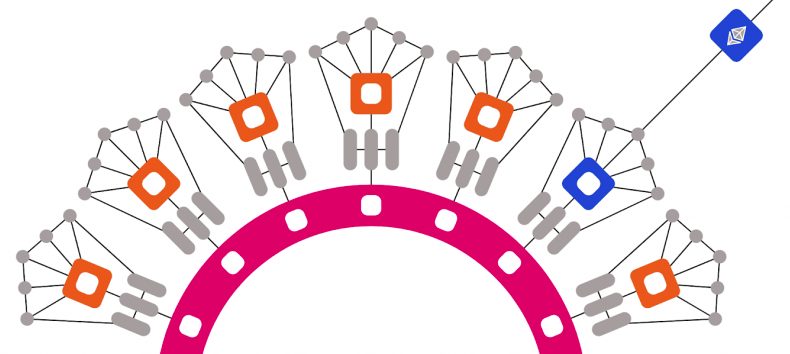

# Polkadot エコシステム

Polkadot エコシステムとは、Polkadot ブロックチェーンプラットフォームとその関連技術に貢献し、それらを活用するプロジェクト、プロトコル、開発者、ユーザー、ステークホルダーのネットワークです。Web3 Foundation によって作られた Polkadot は、異なるブロックチェーン同士が安全かつスケーラブルな方法で接続・通信できるよう設計された、ブロックチェーンの相互運用性プロトコルです。

## Polkadot エコシステムの主要コンポーネント

### Polkadot ネットワーク

エコシステムの中核にあるのが Polkadot ネットワークそのものであり、リレーチェーンとパラチェーンで構成されています。リレーチェーンはメインのブロックチェーンとして機能し、パラチェーンはリレーチェーンに接続する独立したブロックチェーンです。

### パラチェーン

パラチェーンは、Polkadot リレーチェーンと並行して稼働する主権を持ったブロックチェーンです。独自のコンセンサスメカニズム、ガバナンス構造、トークンエコノミーを持つことができます。パラチェーンはパラチェーンスロットと呼ばれるブリッジを介してリレーチェーンに接続し、Polkadot ネットワークのセキュリティと相互運用性の恩恵を受けることができます。

### Substrate フレームワーク

Substrate は Parity Technologies によって作られたブロックチェーン開発フレームワークで、開発者は Polkadot エコシステムと互換性のあるカスタムブロックチェーンやパラチェーンを構築できます。Substrate はモジュール式でカスタマイズ可能なアーキテクチャを提供しており、開発者は特定のニーズに合わせたブロックチェーンプロジェクトを容易に作成できます。

## リレーチェーン

Polkadot リレーチェーンと Kusama リレーチェーンは、それぞれのブロックチェーンネットワークの主要コンポーネントであり、Polkadot エコシステムと Kusama エコシステムの基盤として機能しています。両リレーチェーンは似た設計と目的を持っていますが、それぞれのネットワーク内で異なる役割を担っています。

### Polkadot リレーチェーン

* Polkadot リレーチェーンは、Polkadot ネットワークのメインブロックチェーンです。  
* 異なるパラチェーン間の通信を接続・調整するハブとして機能します。  
* リレーチェーンは、ネットワーク全体の共有セキュリティの維持、バリデーター間のコンセンサスの確保、クロスチェーンの相互運用性の促進を担っています。  
* Polkadot のリレーチェーンは、ノミネーテッド・プルーフ・オブ・ステーク（NPoS）コンセンサスメカニズムを採用しており、トークン保有者はバリデーターをノミネートしてネットワークを保護し、報酬を得ることができます。  
* リレーチェーンはオンチェーンガバナンスメカニズムによって運営されており、トークン保有者はプロトコルのアップグレード、パラメーターの調整、新しいパラチェーンの追加に関する意思決定プロセスに参加できます。

### Kusama リレーチェーン

* Kusama リレーチェーンは、Polkadot のカナリアネットワーク、あるいは実験的ないとこ（姉妹ネットワーク）と呼ばれることがよくあります。  
* Kusama は初期段階の実験とイノベーションのために設計されたネットワークで、開発者は新しい機能、プロトコル、アップグレードを Polkadot にデプロイする前にテストできます。  
* Kusama リレーチェーンは Polkadot リレーチェーンと同様の役割を果たし、パラチェーン間の通信を促進し、バリデーター間のコンセンサスを調整します。  
* ただし、Kusama は Polkadot と比べてよりダイナミックなガバナンスモデルと速い反復サイクルを持っており、リスクを取った取り組みや迅速なイノベーションにより適しています。  
* Kusama のガバナンスプロセスは、より実験的かつ機敏になるよう設計されており、コミュニティのフィードバックとコンセンサスに基づいて変更やアップグレードをより迅速に実装できます。

## パラチェーン

パラチェーンは、Polkadot ネットワーク内で並行して稼働する、主権を持った独立したブロックチェーンです。スケーラビリティ、相互運用性、カスタマイズ性を実現するよう設計された、Polkadot エコシステムの主要コンポーネントの一つです。以下に、パラチェーンの主な特徴と機能を示します。

### 独立したブロックチェーン

パラチェーンは、独自のコンセンサスメカニズム、ガバナンス構造、トークンエコノミーを持つ独立したブロックチェーンとして動作します。独自のネイティブトークンを持つことができ、それぞれのユースケースに特化したスマートコントラクトや分散型アプリケーション（DApps）を実行できます。

### リレーチェーンへの接続

パラチェーンは、「コレーター」と呼ばれる仕組みを通じて、Polkadot ネットワークのメインブロックチェーンである Polkadot リレーチェーンに接続します。コレーターはそれぞれのパラチェーンからトランザクションを収集し、有効性の証明を生成して、ファイナライズのためにリレーチェーンへ送信します。

### 共有セキュリティ

パラチェーンは、Polkadot ネットワークの共有セキュリティの恩恵を受けます。個別のバリデーターによって独自のセキュリティを維持する代わりに、パラチェーンはリレーチェーンのバリデーターが提供するセキュリティに依存します。この共有セキュリティモデルにより、ネットワーク全体のセキュリティが強化され、パラチェーン開発者の負担が軽減されます。

### 相互運用性

パラチェーンはリレーチェーンを介して相互に通信・取引でき、クロスチェーンの相互運用性を実現します。これにより、Polkadot エコシステム内の異なるパラチェーン間で、資産、データ、メッセージをシームレスに交換できます。

### スケーラビリティ

パラチェーンが互いに並行して稼働することで、Polkadot ネットワーク全体のスケーラビリティが向上します。各パラチェーンは独立してトランザクションを処理し、スマートコントラクトを実行できるため、より高いスループットが実現し、ネットワークの混雑が軽減されます。

### ガバナンスとアップグレード

パラチェーンは独自のガバナンスメカニズムを持ち、トークン保有者はプロトコルのアップグレード、パラメーターの調整、新機能の追加に関する意思決定プロセスに参加できます。これにより、パラチェーンのコミュニティは、それぞれのブロックチェーンの進化について自律性と管理権を持つことができます。

パラチェーンは、多様なブロックチェーンプロジェクトが単一のネットワーク内で共存し、相互にやり取りし、協力することを可能にすることで、Polkadot エコシステムにおいて極めて重要な役割を果たしています。柔軟性、スケーラビリティ、相互運用性を備えたパラチェーンにより、Polkadot は分散型アプリケーションや次世代のブロックチェーンソリューションを構築するための強力なプラットフォームとなっています。
