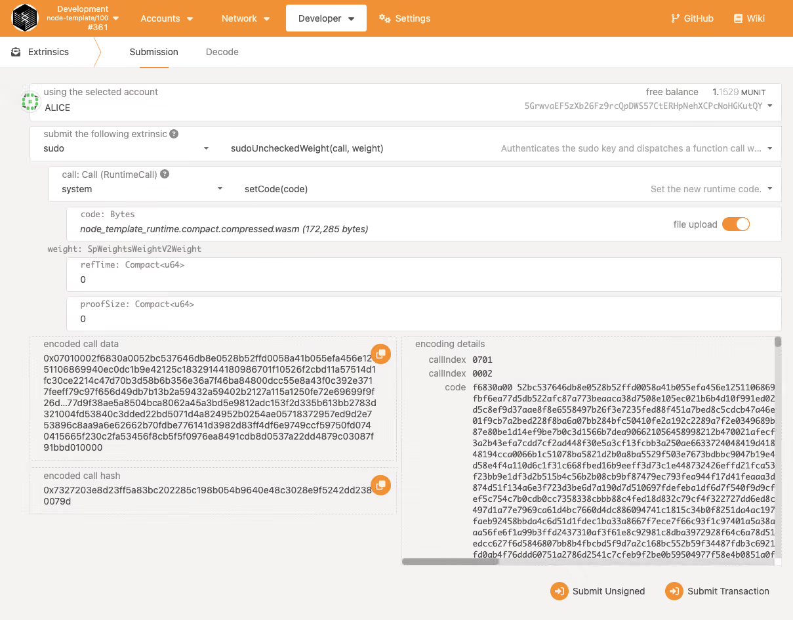
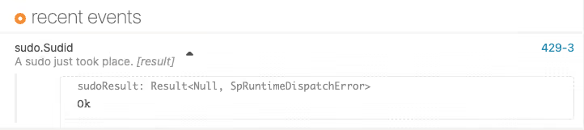
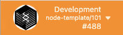

# XODE ガバナンス

Xode ガバナンスは、パナマを拠点とする分散型自律組織（DAO）財団である Xode Foundation の強みと、Polkadot の最先端のオンチェーンガバナンスモデルである OpenGov を融合させた、革新的なガバナンスフレームワークです。このハイブリッドなアプローチは、Xode Foundation の分散型でコミュニティ主導の原則と、Polkadot の透明性が高く、適応的で包括的なオンチェーンの意思決定プロセスを組み合わせたものです。これらの相乗効果を活用することで、Xode ガバナンスは堅牢で参加型のエコシステムを育み、ステークホルダーが協力して分散型技術の未来を形作り、ブロックチェーン全体の持続可能な発展を確保できるようにすることを目指しています。

## Xode Foundation

XODE の創設者によって設立された XODE Foundation は、分散型ウェブ技術の開発を促進し、育成することを主な目的としています。本財団は、ユーザーが自身のデータやデジタル上のやり取りをより自由に管理できる、分散型ウェブの開発と普及を加速させることを目指しています。

### 財団の目的

* 資金提供と支援：XODE エコシステムやその他の Web3 技術を基盤とする、またはそれらを支援するプロジェクトに対して、助成金や資金を提供します。対象にはスタートアップ、開発者、研究者が含まれます。  
* 研究開発：Xode エコシステムの発展を推進するため、分散型プロトコル、暗号技術、ブロックチェーン技術に関する研究を実施・支援します。  
* コミュニティの構築：分散型ウェブの構築に協力する開発者、研究者、愛好家のグローバルなコミュニティを育成します。これには、イベント、カンファレンス、ハッカソンの開催が含まれます。  
* 教育と啓発：教育コンテンツ、ドキュメント、アウトリーチプログラムを制作し、分散型技術の理解と普及を促進します。  
* ガバナンスと標準：分散型技術が安全で、スケーラブルで、相互運用可能であることを確保するため、ベストプラクティス、標準、ガバナンスモデルを策定・推進します。

### 分散型自律組織（DAO）

Xode DAO は、パナマを拠点とする財団を統治主体とする分散型自律組織として運営されています。この財団は、Xode トークンの運用とガバナンスを監督するための法的・規制上の枠組みを提供し、透明性、コンプライアンス、説明責任を確保します。ブロックチェーンの分散型の性質と従来の財団の構造を組み合わせることで、Xode DAO はトークン保有者が意思決定プロセスに積極的に参加できるようにし、財団は法的事項やオフチェーン資産に関する中立的な管理者として機能します。このハイブリッドモデルにより、DAO が効率的かつ持続的に運営される能力が強化され、分散型技術とグローバルな規制基準との橋渡しが実現します。

定款：パナマ財団の定款は、法的枠組みとガバナンス構造を定めるために起草されます。 

評議会メンバー：2 つの評議会の役割と責任を正式に定めるため、任命書が作成されます。2 つの評議会とは、財務およびリソース管理の監督を担う財務評議会（Treasury Council）と、技術開発とイノベーションの指導を担う技術委員会（Technical Committee）です。

事業運営：

* コアチームのコントリビューターと XODE Foundation との間のコンサルティング／雇用契約  
* 知的財産権および免責事項を含むプラットフォーム利用規約  
* 投資契約  
* フィリピンの既存テクノロジー企業（ROCKSON TECH）と XODE Foundation との間のサービス契約の条件

これらのステップは、DAO の運営のための堅牢でコンプライアンスに準拠した基盤を確保するうえで不可欠です。

## OpenGov

Polkadot の OpenGov は、XODE Blockchain 内における分散型の意思決定プロセスを強化するために設計されたガバナンスフレームワークです。コミュニティがネットワークのガバナンスに参加するための、より包括的で透明性が高く、効率的な方法を提供することを目指しています。 

参加の拡大：OpenGov は、ネットワークプロトコルの変更やリソースの配分など、ガバナンスの意思決定に、より幅広いステークホルダーが参加できる仕組みを導入します。

動的なレファレンダム：このフレームワークにより、より柔軟で適応的なレファレンダム（住民投票）が可能になり、コミュニティは変更やアップグレードをより効果的に提案、議論、投票できます。

提案と投票：OpenGov はガバナンス提案の提出と投票プロセスを円滑にし、すべてのステークホルダーがネットワークの進化について発言権を持てるようにします。

透明性と説明責任：ガバナンスプロセスの透明性を高め、参加者に説明責任を持たせることで、ネットワークにとって最善の利益となる意思決定が行われるようにすることを目指しています。

適応性：このシステムは適応性を備えるよう設計されており、コミュニティのフィードバックや変化するニーズに基づいて修正や改善を行うことができます。

OpenGov は、ユーザーのためにより民主的で応答性の高いエコシステムを創り出すことを目指す、Polkadot の分散型ガバナンスという広範なビジョンの一部です。Polkadot の OpenGov の詳細については、こちらをご覧ください：[https://support.polkadot.network/support/solutions/65000105211](https://support.polkadot.network/support/solutions/65000105211) 

### XODE Blockchain ガバナンスロードマップ

Xode Blockchain ガバナンスのロードマップは段階的に進化するよう設計されており、システムがより分散化され、コミュニティのニーズに適応できるようになることを目指しています。

* ##### 2025 年 Q1 \- 基本（コレクティブ、メンバーシップ）

  第 1 フェーズでは、基礎となるガバナンス構造の確立に重点を置きます。これには、コレクティブの創設と、ステークホルダーがガバナンスプロセスに参加できるメンバーシップシステムの実装が含まれます。これらのコンポーネントは、コミュニティ主導の意思決定の基盤を築き、ユーザーが透明性が高くアクセスしやすいフレームワークを通じてブロックチェーンに関与できるようにします。

* ##### 2025 年 Q3 \- ガバナンス v1（Democracy、Reference、Conviction-Voting、Preimage、Scheduler など）

  次のフェーズでは、ガバナンス v1 を導入し、民主主義ベースの投票メカニズム、レファレンス管理、コンビクション投票などの主要機能を組み込んで意思決定を強化します。Preimage のサポートにより提案の追跡が改善され、スケジューラーシステムによりガバナンスの決定が効率的に実行されます。このフェーズは、ガバナンスモデルを確固たるものにし、ステークホルダーにより大きな管理権と、プロトコルのアップグレードや変更に影響を与える能力を与えることを目指しています。

* ##### 2025 年 Q4 \- ガバナンス v2/OpenGov 

  将来に向けて、Xode はより高度で柔軟なガバナンスモデルであるガバナンス v2/OpenGov を採用します。OpenGov は透明性の向上とよりダイナミックな構造をもたらし、コミュニティ主導の提案と意思決定の分散型実行を可能にします。このフェーズでは、DAO 形式の投票システム、オンチェーンのアイデンティティ管理、モジュール性の向上など、より高度な機能を取り入れ、真に分散化されたガバナンスフレームワークを実現します。

このロードマップは、達成された進捗とマイルストーンを反映するために四半期ごとに更新され、コミュニティの意見が Xode Blockchain ガバナンスの継続的な発展を形作ります。

### XODE Blockchain v0.1.0（RuntimeUpgrade）の実装

Zeeve は、XODE Blockchain のテストネットとメインネットの両環境において、コレーターのブートノードインフラを提供する主要なプロバイダーです。XODE ネットワークの維持と強化に対する継続的な取り組みの一環として、両環境のランタイムに対する重要なアップグレードを計画しています。テストネットのアップグレードは 2024 年 9 月に予定されており、続いてメインネットのアップグレードが 2025 年 1 月に予定されています。これらのアップグレードは、パフォーマンス、セキュリティ、機能性を向上させ、XODE Blockchain の継続的な安定性と発展を確保するよう設計されています。

リリースされたランタイムアップグレードは、コンパイル済みのランタイムとリリースノートとともに [xode-blockchain のリリースページ](https://github.com/D2-Xode/xode-blockchain/releases) で公開されます。各リリースの内容については [ランタイムアップグレード](/ja/network/runtime-upgrade) を参照してください。

アップグレードの手順：  
***注意：多くのチームが採用しているのは 2 段階のプロセスです \- まず sudo パレットと democracy パレットの両方を含むランタイムにアップグレードし、democracy が機能することを確認します。その後で初めて（democracy パレットを使用して）sudo を含まない新しいランタイムへのアップグレードについて投票します。***

1. 次の例を参考に、現在のコードに変更（新しいパレットの追加）を加えます：[https://docs.substrate.io/tutorials/build-a-blockchain/upgrade-a-running-network/\#add-the-utility-pallet-to-the-runtime](https://docs.substrate.io/tutorials/build-a-blockchain/upgrade-a-running-network/#add-the-utility-pallet-to-the-runtime)  
2. 新しいランタイムを再コンパイルし、target/release/wbuild/node-template-runtime ディレクトリにある WebAssembly のビルド成果物を取得します。  
3. これで、変更されたランタイムロジックを記述した WebAssembly の成果物が得られました。ただし、稼働中のノードはまだアップグレードされたランタイムを使用していません。アップグレードを完了するには、ノードがアップグレードされたランタイムを使用するよう更新するトランザクションを送信する必要があります。    
4. アップグレードされたランタイムでネットワークを更新するには：  
1. ブラウザで Polkadot/Substrate Portal を開きます。  
2. Developer をクリックし、Extrinsics を選択して、ランタイムが新しいビルド成果物を使用するためのトランザクションを送信します。  
3. 管理用の Alice アカウントを選択します。  
4. sudo パレットと sudoUncheckedWeight(call, weight) 関数を選択します。  
5. Alice アカウントを使用して実行する呼び出しとして、system と setCode(code) を選択します。  
6. file upload をクリックし、更新したランタイム用に生成した、コンパクトかつ圧縮された WebAssembly ファイル node\_template\_runtime.compact.compressed.wasm を選択するか、ドラッグ＆ドロップします。  
7. たとえば、target/release/wbuild/node-template-runtime ディレクトリに移動し、アップロードするファイルとして node\_template\_runtime.compact.compressed.wasm を選択します。  
8. 両方の weight パラメーターはデフォルト値の 0 のままにしておきます。

   

9. Submit Transaction をクリックします。  
10. 承認内容を確認し、Sign and Submit をクリックします。  
11. Network をクリックして Explorer を選択し、sudo.Sudid イベントが正常に発生したことを確認します。

    

12. トランザクションがブロックに取り込まれると、ノードテンプレートのバージョン番号により、ランタイムのバージョンが 101 になったことが示されます。例：

    

    ローカルノードがターミナル上で生成しているブロックがブラウザに表示されている内容と一致していれば、ランタイムのアップグレードは成功です。

プロバイダーの連絡先情報：[https://www.zeeve.io/](https://www.zeeve.io/) 
