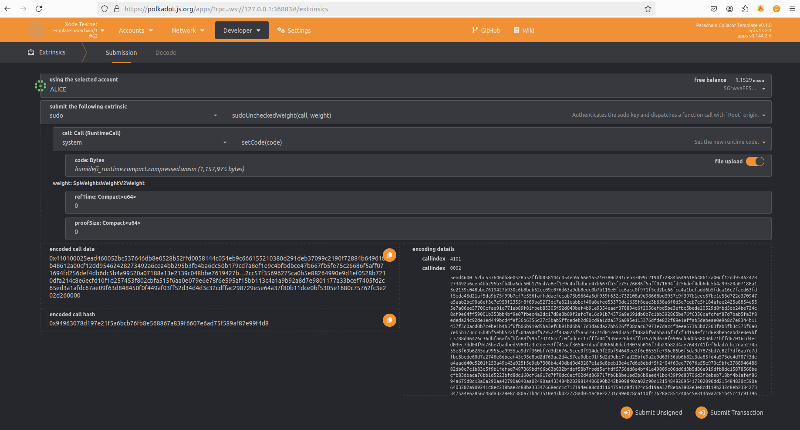
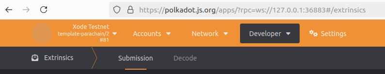

# ランタイムアップグレード

## ランタイムアップグレードの公開場所

XODE のランタイムアップグレードは [xode-blockchain のリリースページ](https://github.com/D2-Xode/xode-blockchain/releases) で公開されます。各リリースには、ランタイムの新しい `spec_version` を含む変更内容の説明と、次のファイルが付属します。

| ファイル | 内容 |
| --- | --- |
| `xode_runtime.compact.compressed.wasm` | アップグレードでチェーンに適用される、コンパイル済みのランタイム |
| `xode-node` | x86-64 用のノードバイナリ |
| `xode-node-aarch64` | ARM64（aarch64）用のノードバイナリ |
| `polkadot_raw_chain_spec.json` | Polkadot 上の XODE 用チェーンスペック |

2026 年 9 月時点の最新リリースは [v0.1.2.14](https://github.com/D2-Xode/xode-blockchain/releases/tag/v0.1.2.14) で、`spec_version` を 14 に引き上げました。チェーンで実行中のランタイムを確認するには、XODE に接続した [Polkadot.js Apps](https://polkadot.js.org/apps/?rpc=wss%3A%2F%2Fpolkadot-rpcnode.xode.net#/explorer) を開きます。左上にランタイム名とバージョンが表示されます（例：`xode-runtime/14`）。

このページの以降の部分では、ローカルのテストネットワークでランタイムアップグレードを試す方法を説明します。

## pallet-sudo を使用したランタイムアップグレードのシミュレーション

1. Xode バイナリをダウンロードします

`x86_64`

```bash
curl -L "https://github.com/D2-Xode/xode-blockchain/releases/download/v0.1.2.14/xode-node" -o xode-node
```

2. Zombienet を使用してノードを実行します  

```bash
./zombienet-launch.sh
```

3. 新しいターミナルを開きます  

4. コードを変更します（バージョンを変更）  

`runtime/src/lib.rs`

```rust
#[sp_version::runtime_version]
pub const VERSION: RuntimeVersion = RuntimeVersion {
    spec_name: create_runtime_str!("template-parachain"),
    impl_name: create_runtime_str!("template-parachain"),
    authoring_version: 1,
    spec_version: 2, // Modify only this
    impl_version: 0,
    apis: RUNTIME_API_VERSIONS,
    transaction_version: 1,
    state_version: 1,
};
```

5. コードをコンパイルします  

```bash
cargo build --release --package xode-node
```

6. wasm ファイルの場所を確認します

```text
./target/release/wbuild/xode-runtime/xode_runtime.compact.compressed.wasm
```

7. Polkadot.JS（Zombienet/Parachain）を開きます。SUDO を使用して WASM ファイルをアップロードします。  

     

8. 新しいランタイムバージョン template-parachain/2 になっているかを確認します  

   

## pallet-democracy（OpenGov）を使用したランタイムアップグレードのシミュレーション
