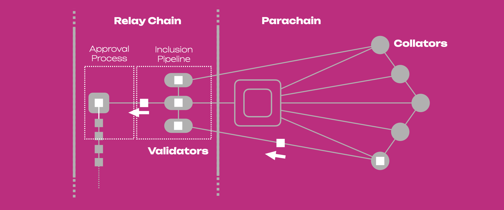

# XODE ネットワーク

XODE Blockchain ネットワークは複数の重要なコンポーネントで構成されており、それぞれが、より広い Polkadot エコシステムにおけるブロックチェーンの機能と相互運用性において、固有の役割を担っています。主要なコンポーネントは次のとおりです。

### パラチェーン

ネットワークの中核にあるのはパラチェーンそのものです。これは、指定されたパラチェーンスロットを通じて Polkadot/Kusama リレーチェーンに接続する独立したブロックチェーンです。パラチェーンは、それぞれのユースケースや要件に合わせた独自のルール、コンセンサスメカニズム、ガバナンス構造を持っています。

### パラチェーンスロット

パラチェーンスロットは、Polkadot/Kusama リレーチェーン内で個々のパラチェーンに割り当てられる限られたリソースです。パラチェーンスロットを確保することで、パラチェーンはリレーチェーンに接続し、Polkadot ネットワークに参加できるようになります。スロットは分散型のオークションメカニズムを通じて取得され、パラチェーンプロジェクトは DOT/KSM トークンを入札して、指定された期間のスロットを確保します。

### Polkadot/Kusama リレーチェーン

リレーチェーンは Polkadot ネットワークの心臓部として機能し、パラチェーン間の通信と相互運用性を実現します。バリデーター間のコンセンサスを調整し、ネットワークのセキュリティを管理し、パラチェーン間のメッセージや資産の転送を可能にします。

### コレーター

コレーターは、パラチェーンに代わってブロック候補を生成する役割を担います。トランザクションを収集し、状態遷移を実行し、それらをブロックにまとめ、最終確定のためにバリデーターへ送信します。コレーターは、パラチェーンの運用と完全性を維持するうえで重要な役割を果たします。

### バリデーター

バリデーターは、リレーチェーン上のブロックを最終確定し、ネットワークのセキュリティとコンセンサスを確保する役割を担います。ブロックの提案と検証、担保としての DOT/KSM トークンのステーキング、ガバナンスの意思決定への参加を通じて、ブロック生成とコンセンサスのプロセスに参加します。

### メッセージパッシングプロトコル

パラチェーンは、メッセージパッシングプロトコルを通じて相互に、またリレーチェーンと通信します。このプロトコルにより、パラチェーン間でメッセージ、資産、データを転送でき、Polkadot ネットワーク全体での相互運用性と連携が可能になります。

### ブリッジ

ブリッジは、パラチェーンと外部のブロックチェーンやネットワークとの間の通信を可能にするコネクターです。異なるブロックチェーンエコシステム間で資産やデータを転送できるようにし、パラチェーンの到達範囲と有用性を Polkadot ネットワークの外へと広げます。

これらのコンポーネントが連携することで、Polkadot ネットワーク内にダイナミックで相互運用可能なエコシステムが生まれ、パラチェーンは自律性と主権を保ちながら、連携し、資産を交換し、共有セキュリティを利用できるようになります。

## XODE Blockchain のコレーターノードとリレーチェーンのバリデーターノード

  
Polkadot エコシステム内の XODE Blockchain において、コレーターとバリデーターの関係はネットワークの運用とセキュリティにとって極めて重要です。これらの役割がどのように相互作用するのか、技術的な詳細を見ていきましょう。

### コレーター

* コレーターは、パラチェーンに代わってブロック候補を生成する役割を担います。トランザクションを収集し、状態遷移を実行し、それらをブロックにまとめます。  
* コレーターはトランザクションを収集すると、パラチェーンの現在の状態など、その他の必要なデータとともにそれらをブロックにまとめます。  
* コレーターは独立して動作し、通常は特定のパラチェーンに関連付けられています。パラチェーンの状態のローカルコピーを保持し、パラチェーンのコンセンサスメカニズムで定義されたルールに従ってトランザクションを実行します。  
* ブロックを組み立てた後、コレーターはそれを検証のためにネットワークへブロードキャストします。

### バリデーター

* バリデーターは、Polkadot リレーチェーン上のブロックを最終確定し、ネットワークのセキュリティとコンセンサスを確保する役割を担います。  
* パラチェーンの文脈では、バリデーターはコレーターが生成したブロックを検証するという重要な役割を果たします。トランザクションの正当性を確認し、状態遷移を実行し、ブロックが Polkadot ネットワークのルールとプロトコルに準拠していることを確認します。  
* バリデーターは、ブロックの提案と検証を通じてブロック生成とコンセンサスのプロセスに参加します。ブロック生成への参加者は、ネットワークにおけるステーク量と、信頼できるバリデーターとしての評判に基づいて選出されます。  
* バリデーターは、コレーターから提出されたブロックについて、トランザクションを確認し、パラチェーンの現在の状態に対して実行することで検証します。トランザクションが有効であること、状態遷移が正しいこと、そしてブロックがネットワークのコンセンサスルールに準拠していることを確認します。
