# Xterium ウォレット

Xterium は XODE ブロックチェーンの公式ウォレットです。現在のバージョンは **Xterium: XODE Wallet** で、ピンクのロゴが目印の Android および iOS 向けアプリです。

## アプリのインストール

* Android：[Google Play の Xterium: XODE Wallet](https://play.google.com/store/apps/details?id=net.xode.xtr)
* iOS：[App Store の Xterium: XODE Wallet](https://apps.apple.com/app/id6809356501)

::: warning ストアには 2 つの Xterium アプリがあります
Google Play と App Store には、旧 Xterium アプリも引き続き掲載されています。必ずピンクのロゴの **Xterium: XODE Wallet** をインストールしてください。

| | こちらをインストール | 旧バージョン |
| --- | --- | --- |
| ロゴ |  |  |
| ストアでのアプリ名 | Xterium: XODE Wallet | Xterium |
:::

## Xterium でできること

* **鍵は自分のスマートフォンで管理**：Xterium はノンカストディアル型のウォレットです。鍵はお使いの端末上で暗号化され、PIN または生体認証でロックが解除されます。Xterium がリカバリーフレーズを知ることは一切ありません。
* **XON や USDT などの資産を保有**：XODE と Polkadot Hub 上の資産を、1 つのポートフォリオでまとめて管理できます。
* **送金と受け取り**：QR コードとアドレス帳を使って、資産を送受信できます。
* **XON のステーキング**：コレーターに XON をステーキングして、ブロック報酬の一部を獲得できます。詳しくは [XODE ステーキング](/ja/network/xode-staking) を参照してください。
* **ガバナンスの動向を把握**：オンチェーンのトレジャリー提案を確認できます。評議会メンバーは、アプリ内で投票することもできます。詳しくは [XODE ガバナンス](/ja/introduction/xode-governance) を参照してください。
* **スマートフォンでノードを実行**：XODE omni を使ってお使いのスマートフォンをノードとして動かし、報酬を獲得できます。詳しくは [スマホがノードになるとき](/ja/engineering/phones-as-nodes) を参照してください。
* **Ethereum 互換アプリを利用**：独立した EVM アカウントと WalletConnect を通じて、Ethereum 互換のアプリを使用できます。詳しくは [EVM スマートコントラクト](/ja/smart-contract/evm-smart-contract) を参照してください。
* **Polkadot Hub と XODE の間で USDT を移動**：移動には XCM を使用します。この機能は現在も順次展開中です。
* **英語、韓国語、日本語、中国語に対応**：アプリは端末の言語設定に従って表示されます。

::: danger リカバリーフレーズをバックアップしてください
Xterium は自己管理型のウォレットです。リカバリーフレーズを書き留め、安全な場所に保管してください。紛失した場合、Xterium 側でウォレットを復元することはできません。
:::

## 旧バージョン

以下のセクションでは、Xterium の過去のリリースと、それより前に提供されていた Xode Wallet について説明します。

### Xterium アプリとブラウザ拡張機能（青緑色のロゴ）

旧 Xterium アプリは、現在も [Google Play](https://play.google.com/store/apps/details?id=com.xterium.wallet) と [App Store](https://apps.apple.com/app/id6745164228) で入手できます。ブラウザ拡張機能は [Chrome ウェブストア](https://chromewebstore.google.com/detail/xterium/klfhdmiebenifpdmdmkjicdohjilabdg) で公開されています。

### ブラウザ拡張機能ベータ版：手動インストール（Chrome）

Xterium Wallet ブラウザ拡張機能は、ブラウザから直接 Xode Blockchain とやり取りできるよう設計された、ブラウザベースのデジタルウォレットです。この拡張機能はユーザーの秘密鍵を安全に保管し、ブロックチェーンネットワークへのシームレスなアクセスを可能にします。これにより、暗号資産の送受信、トークンの管理、スマートコントラクトとのやり取りなどの操作を行うことができます。 

パッケージ（Zip ファイル）はこちらからダウンロードしてください。

* [Xterium v0.2.2（ベータ版）](https://drive.google.com/uc?export=download&id=1bVMGSJQNj-BJ7Dza2yNMxoFZRfqxVBkq)  
* [Xterium v0.2.0（ベータ版）](https://drive.google.com/uc?export=download&id=1Z7Yb8YeyUhjZbUWf8-c2ukle1QLbYCq3)  
* [Xterium v0.1.3（ベータ版）](https://drive.google.com/uc?export=download&id=1wjBgg4viy1pxAF9VnKDkIj68hivCJsAm)  
* [Xterium v0.1.2（ベータ版）](https://drive.google.com/uc?export=download&id=1rAS169wz4rk0IT3OVT9XLd-fyJef7us7)  
* [Xterium v0.1.1（ベータ版）](https://drive.google.com/uc?export=download&id=1139wf3T4doSZR0zrv7CO-j40YyC7dTCq)

#### Zip ファイルをディレクトリ（chrome-mv3-prod）に展開します

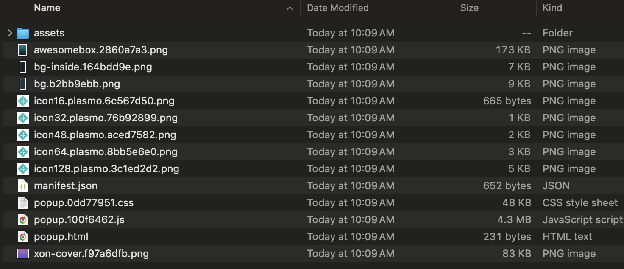

#### Chrome（chrome://extensions/）を開き、ディレクトリ（dist）を読み込みます

* アドレスバーに次の URL を入力して開きます：chrome://extensions/  
* デベロッパーモードのスイッチをオンにします：  
  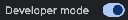  
* 「パッケージ化されていない拡張機能を読み込む（Load unpacked）」を使用してディレクトリを読み込みます：  
  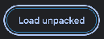  
* Chrome で拡張機能が利用可能になっていることを確認できます  
  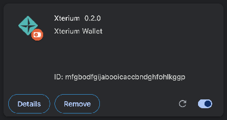

これで、拡張機能ボタンから Xterium Wallet を使い始めることができます。

* Chrome の拡張機能アイコンを開いて Xterium Wallet を選択します。必要に応じてピン留めすることもできます。  
  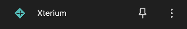

### ブラウザ拡張機能ベータ版の使い方

#### 初めてウォレットを開くとき

* パスワードを設定します（必ず覚えておいてください。パスワードを忘れた場合、復旧をお手伝いする方法はありません。パスワードがなければ、ウォレットのすべての情報にアクセスできなくなります。  
  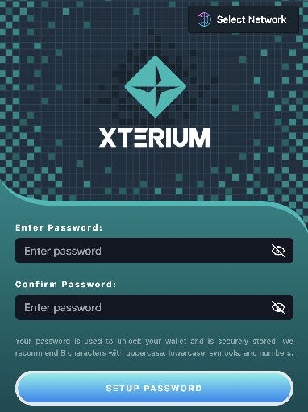  
* Xterium は Polkadot エコシステムの複数のネットワークをサポートする予定のため、最初に Xode ネットワークを選択してください。  
  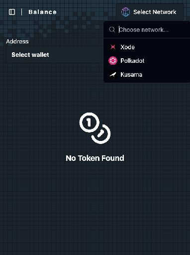  
  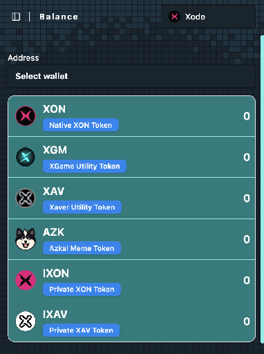  
* 次に、ウォレットアドレスを追加します。サイドバーメニューに移動し、「Wallets」をクリックします。新しいウォレットを追加するか、シードフレーズ（秘密鍵）を使用して既存のウォレットをインポートできます。  
  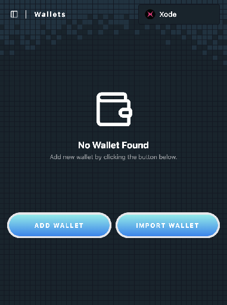  
* ウォレットを作成するには、ウォレットの名前とニーモニックフレーズ（自動生成も可能）を入力する必要があります。シードと公開アドレスは自動的に作成されます。  
  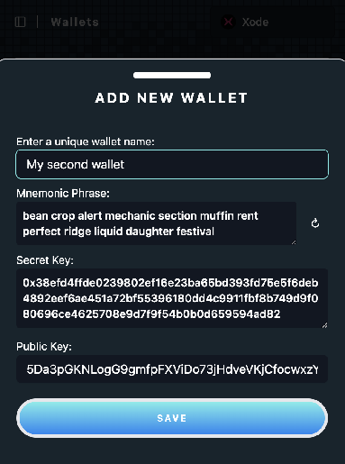  
  非常に重要：ニーモニックフレーズは必ずバックアップし、決して誰とも共有しないでください\!  
* 保存するとすぐに残高タブに移動します。ここで残高を確認できます。    
  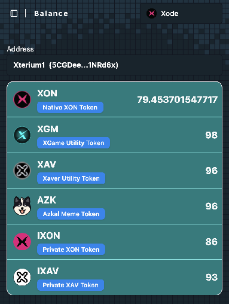

#### 送金

* 残高タブから送金ボタンをクリックします。送金できるのは、現在の残高（Current Balance）がある資産のみです。また、IXON や XGM などの他の資産を送金する前に、まず XON などのネイティブ資産を送金する必要があります。送金するには、数量と受取人のアドレスを入力するだけです。  
  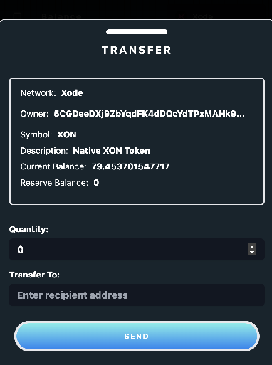  
* 送金を確認します。ウォレットには XON 建ての推定手数料が表示されます。確認すると、残高タブに戻ります。  
  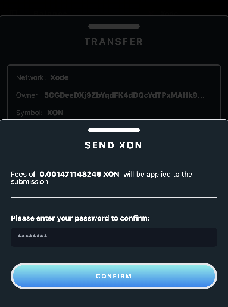  
  非常に重要：これはベータ版のため、ファイナリティのコールバックに遅延があり、残高がすぐに更新されない場合があります。数秒待ってから残高タブを更新してください。また、アドレスに XON がない場合は、IXON などの非ネイティブ資産を送金しないでください。

#### 資産の追加または削除

* 「Assets」タブに移動します。資産を削除するには、ゴミ箱の削除アイコンをクリックするだけです  
  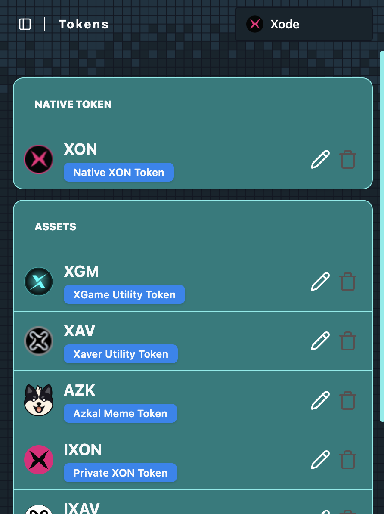  
* 資産を追加するには、資産の種類（例：Native、Asset（pallet-assets）、Contract（XON20/pallet-contracts））を指定する必要があります。ネットワーク ID が正しいことを確認してください。Asset の場合はチェーン（Xode）の asset id を確認し、Contract の場合はコントラクトアドレスを使用します。  
  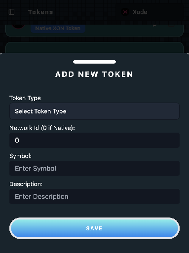

### Xode Wallet（Xterium 以前）

#### Android

注意：Xode Wallet の APK は、Android モバイル端末に手動でインストールする必要があります。Google Play では提供されていません。 

* [Xode Android Wallet APK（v0.1.1 ベータ版）\- 最新](https://drive.google.com/uc?export=download&id=1LqFzSqMPG79bU5_qefmrXnHSLfJf60p5)  
* [Xode Android Wallet APK（v0.1.0 ベータ版）](https://drive.google.com/uc?export=download&id=19BCpsgucQV4jxlc6CbwT87cYwLkXvaY5)

#### iOS App Store

* [https://apps.apple.com/ee/app/xode-wallet/id6479734235](https://apps.apple.com/ee/app/xode-wallet/id6479734235) 
