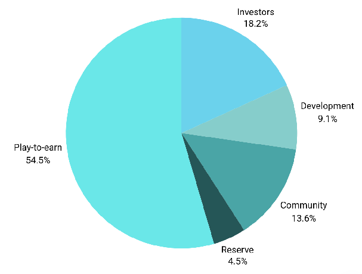
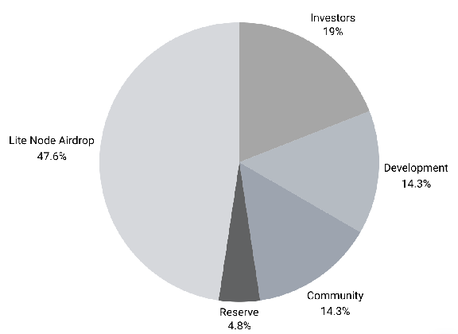
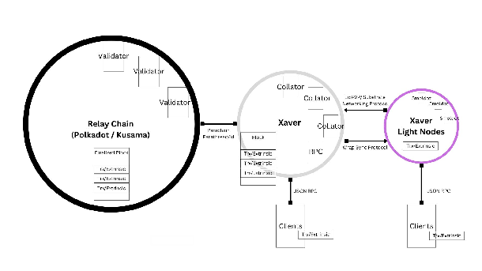
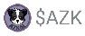
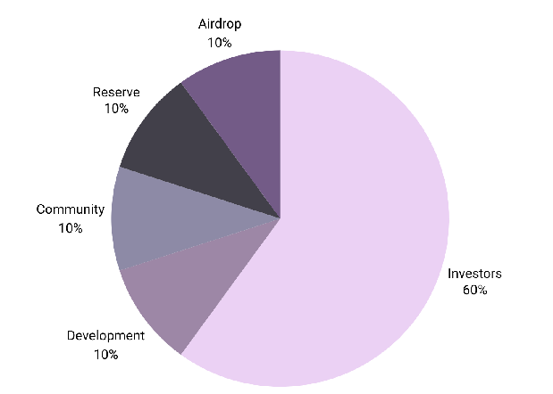
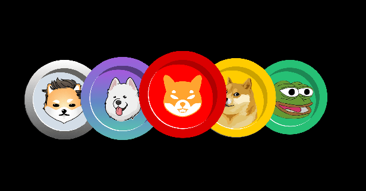
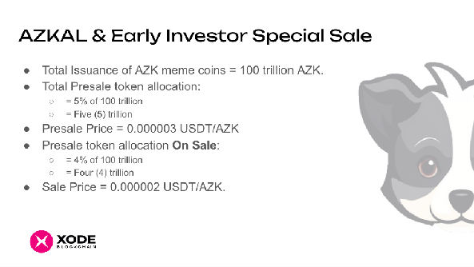
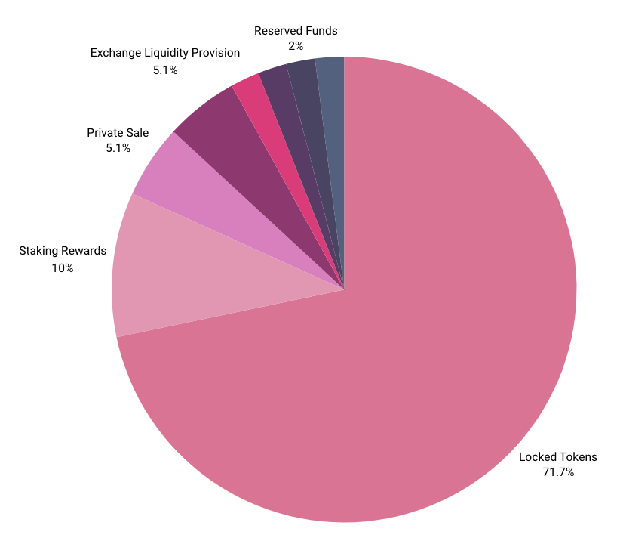

# その他のアセット

## XGame ユーティリティトークン

**\$XGM** は、XGame プラットフォーム内で専用に作成・使用されるデジタルアセットです。ブロックチェーン技術に基づいて構築されており、ゲームアセットの安全な所有、転送、取引を可能にします。

総流通量：1,000 億  
価格：\$0.00  
時価総額：\$0.00  
年間インフレ率：0%  
小数点以下桁数：12  
Existential Deposit（最低保有残高）：0.01 XGM

投資家：200 億  
Play-to-earn：600 億  
開発：100 億  
コミュニティエンゲージメント：150 億  
準備金：50 億

トレジャリー管理は Xode OpenGov と Humidefi 流動性プールを通じて行われます

### 投資家向け情報

\$XGM は Polimec などのローンチパッドを通じて提供されます。トークンの大部分は、XGame プラットフォーム内のすべてのゲームの Play-to-earn モデルに充てられます。 

### 外部監査機関

Certik

### XGame プラットフォーム

XGame は、従来のゲーム要素と Web3 ゲームエコシステムの解放的な力を組み合わせた、没入型ゲームプレイを楽しめる新しくエキサイティングなプラットフォームです。XGame では、ファンタジーの世界で獲得した報酬やアセットが現実のものになります。

### プレイして、稼いで、収益化しよう\!

XGame では、さまざまなゲームが提供するスリリングな冒険に没頭できます。クエスト、壮大なバトル、古代の謎の解明など、一人でも友人とでも楽しめます。ゲームのスリルと興奮はそれ自体が報酬ですが、XGames をプレイすることで、あなたと友人はゲーム内デジタルアセットや NFT という形で報酬を獲得できます。これらの NFT は、XGame 環境の外で転送、販売、取引することができます。これはどんな魔法でしょうか？ファンタジーの世界で獲得した報酬やゲーム内デジタルアセットが現実のものになるのです\!まさに目の前の法定通貨としてリアルなのです。

### 複数のトークン

XGame エコシステムでは、ネイティブデジタル通貨は Xode ネイティブトークン、すなわち \$XON です。XGame のネイティブトークンである \$XGM は主要な交換手段であり、XGame のプレイヤーはゲーム内アセットをシームレスに購入、販売、取引できます。

XGame プラットフォームでゲームごとにトークンを用意することには、いくつかの重要なメリットがあります。第一に、各ゲームの具体的な仕組み、課題、報酬に合わせた独自の経済圏を各ゲーム内に構築できます。これにより、開発者はゲームプレイとプレイヤーのエンゲージメントを高める、きめ細かく調整された経済システムを作ることができます。第二に、ゲームごとに別々のトークンを持つことで、ゲーム内アセットの価値と有用性が明確かつ透明になり、異なるゲーム体験の間での混乱や投機を防ぐことができます。 

## XAV \- Xaver ユーティリティトークン

**\$XAV** は、分散型のライトクライアント Xode ノードである Xaver プラットフォーム内で専用に作成・使用されるデジタルアセットです。Xaver は、ブロックチェーンとローカルでやり取りしたい企業向けに設計されています。

総流通量：1,000 億  
価格：\$0.00  
時価総額：\$0.00  
年間インフレ率：0%  
小数点以下桁数：12  
Existential Deposit（最低保有残高）：0.01 XAV

投資家：200 億  
ハードウェア：600 億  
開発：100 億  
コミュニティエンゲージメント：150 億  
準備金：50 億

トレジャリー管理は Xode OpenGov と Humidefi 流動性プールを通じて行われます

### 投資家向け情報

\$XAV は Polimec などのローンチパッドを通じて提供されます。トークンの大部分は、Xaver プラットフォーム内のすべてのライトノードクライアントへのエアドロップに充てられます。 

### 外部監査機関

Certik

### ライトノード

ブロックチェーンエコシステムにおけるユーザーインターフェースの大半は、通常サーバー（PolkadotJS など）に接続することで機能し、そのサーバーが少数の信頼されたブロックチェーンノードにつながっています。これらのノードは潜在的な単一障害点となります。一般に、トラストレスな方法でブロックチェーンと安全にやり取りするには、フルノードを同期することが不可欠です。しかし、このプロセスには相当な知識、労力、リソースが必要です。

そこで不可欠となるのがライトノードです。基本的に、ライトノードはブロックチェーンのピアツーピアネットワークに接続し、複数のフルノードとやり取りできます。フルノードとは異なり、ライトノードは継続的な稼働や大量のデータストレージを必要としません。代わりに、ユーザーの残高の照会など、必要な情報の取得をフルノードに依存します。 

スマホでライトノードを動かし、それを証明する方法については、[スマホがノードになるとき](/ja/engineering/phones-as-nodes)を参照してください。

### ガバナンス

\$XAV 保有者はガバナンス権を持ち、オンチェーン投票を通じて、プロトコルのアップグレード、パラメーターの変更、その他のガバナンス事項に関する意思決定プロセスに参加できます。

\$XAV トークンは Xaver ネットワークでのステーキングに使用されます。バリデーターとノミネーターは \$XAV をステークして、それぞれブロック生成と検証に参加します。\$XAV をステーキングすることでネットワークの安全性が高まり、追加の \$XAV トークンという形で報酬を獲得できます。

### トランザクション手数料

\$XAV トークンは Xaver ネットワーク上のトランザクション手数料の支払いに使用されます。Xaver 上でトランザクションを送信したり、スマートコントラクトを実行したりするユーザーは、\$XAV で手数料を支払う必要があります。

### 報酬計算の例

ネットワーク内でステークされている XAV トークンの総量：10,000,000 XAV  
ノードの報酬プールの総額：1,000 XAV（エラごと）  
ノード数：1,000  
ノードが生成したブロック数：10  
エラ内で生成されたブロックの総数：1,000

ノードのブロック生成報酬の取り分 \= (10 / 1,000) \* 1,000 XAV \= 10 XAV  
バリデーターのブロック検証報酬の取り分 \= 1,000 XAV / 1,000 \= 1 XAV  
ノードの報酬の合計 \= 10 XAV（ブロック生成分）\+ 1 XAV（ブロック検証分）\= 11 XAV

## AZK \- Azkal ミームトークン

**\$AZK**（Azkal トークン）は、Dogecoin や Shiba Inu などと同様の Xode のミームトークンで、オンラインでのコンテンツクリエイターへのチップ、慈善活動の支援、さらには一部の場所での支払い手段として使用されます。 

総流通量：100 兆  
価格：\$0.00  
時価総額：\$0.00  
年間インフレ率：0%  
小数点以下桁数：12  
Existential Deposit（最低保有残高）：0.01 AZK

投資家：60 兆  
エアドロップ：10 兆  
開発：10 兆  
コミュニティエンゲージメント：10 兆  
準備金：10 兆

トレジャリー管理は Xode OpenGov と Humidefi 流動性プールを通じて行われます

### 投資家向け情報

\$AZK は Polimec などのローンチパッドや、Xode でのランダムなエアドロップを通じて提供されます。トークンの大部分は、すべての Xode ウォレット保有者へのエアドロップに充てられます。

### 外部監査機関

Certik

### ミームトークン

ミームトークンとは、真剣な投資や実用目的ではなく、一般的に遊び心から、あるいはインターネットミームをもとに作成される暗号資産トークンの一種です。これらのトークンは、ユーモラスまたは風刺的なテーマを持つことが多く、人気のインターネット文化、ミーム、トレンドを題材にしている場合があります。長期的な存続性や実用性をあまり考慮せずに短期間で作成されることが多く、明確なユースケースや強力な開発チームといったファンダメンタルズを欠いている場合もあります。 

ミームトークンは、その目新しさや拡散性によって人気と注目を集め、投機的な取引や急激な価格変動につながることがあります。しかし、エンターテインメント性以外に実質的な価値や有用性を持たない場合もあるため、一般的には非常にリスクが高く、ボラティリティの大きい投資とみなされています。ミームトークンの例としては、Dogecoin、Shiba Inu のほか、暗号資産の分野で登場した多くのトークンが挙げられます。

### コミュニティでの人気

ミームコインは大きな人気を集めており、オンラインでのコンテンツクリエイターへのチップ、慈善活動の支援、さらには一部の場所での支払い手段として使用されてきました。また、投機的な取引が行われた時期もあり、価格の変動につながりました。ミームコインは、他の一部の暗号資産ほど本格的な開発や実用性を備えていないかもしれませんが、熱心なコミュニティと独自の文化によって、長年にわたり暗号資産の分野で存在感を維持してきました。

### トークノミクス

セール/プレセールの仕組み  

## IXON \- プライベート XON トークン

**\$IXON** は初期投資家向けのトークンで、後に Xode Blockchain のネイティブトークンである XON と 1:1 の比率で交換できる一時的なアセットとして機能します。このトークンはプライベートセール中に配布され、プロジェクトの長期的な目標との整合性を確保するために、ベスティング期間、ロックアップ、コンプライアンスの仕組みなどの機能を含む場合があります。メインネットのローンチやネイティブトークンの流動性確保といった特定のマイルストーンを達成すると、プライベートトークンはネイティブトークンと引き換えにバーンされ、供給の完全性が保たれるとともにトークン経済が支えられます。このアプローチにより、初期の支援者に有利なアクセスを提供しながら、安全で体系的な資金調達が可能になります。

総流通量：12 億  
価格：\$0.00  
時価総額：\$0.00  
年間インフレ率：0%  
小数点以下桁数：12  
Existential Deposit（最低保有残高）：0.01 XON

IXON ロックアップ \- 70%（8 億 5,700 万 IXON）

* バーンスケジュール：毎年、ロックされたコインの 10% が 8 年間にわたってバーンされます。

ステーキング報酬 \- 10%（1 億 2,000 万 IXON）

* 年間報酬率：4%

残りの配分 \- 20%（2 億 4,400 万 IXON）

* プライベートセール \- 5%（6,100 万 IXON）  
* 取引所への流動性供給 \- 5%（6,100 万 IXON）  
* 開発者 \- 2%（2,400 万 IXON）  
* マーケティング \- 2%（2,400 万 IXON）  
* パートナーシップ \- 2%（2,400 万 IXON）  
* 準備金 \- 2%（2,400 万 IXON）  
* 創設者 \- 2%（2,400 万 IXON）

IXON トークンはプライベートセールにのみ使用されるため、リリースされ XON と交換可能になるのは 6,100 万 IXON のみです。
