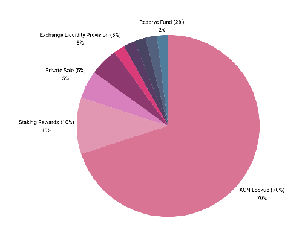

# 토크노믹스

XON은 Xode Blockchain 내 트랜잭션의 교환 수단으로 사용되며, 네트워크 참여자에 대한 인센티브 제공, 트랜잭션 수수료 지불, 스마트 컨트랙트(smart contract) 실행 지원 등 다른 기능도 수행할 수 있습니다.

## 총 공급량 및 초기 가격

### 총 공급량

* 총 공급량: 12억 (1,224,937,488.2724) XON

### API 엔드포인트

* 총 공급량: [https://wallet-api.xode.net/chain/totalsupply](https://wallet-api.xode.net/chain/totalsupply)   
* 총 유통 공급량: [https://wallet-api.xode.net/chain/circulatingsupply](https://wallet-api.xode.net/chain/circulatingsupply) 

## 코인 분배

### XON 락업 \- 70%

* 락업된 코인: 8억 5,700만 (857,456,241.79068) XON  
* 관리: Xode Foundation(DAO)이 관리  
* 스테이킹 구조: 락업된 코인은 Xode Foundation(DAO) 내에 보관됨  
* 소각 일정:   
  * 8년에 걸쳐 매년 락업된 코인의 10%가 소각됩니다.  
  * 소각 일정은 시장 상황에 대응하기 위해 거버넌스(governance) 결정에 따라 유동적으로 조정될 수 있습니다.

### 스테이킹 보상 \- 10%

* 코인 수량: 1억 2,000만 (122,493,748.82724) XON   
* 연간 보상률: 4%  
* 목적: 스테이킹(staking) 참여를 통해 네트워크의 안정성과 보안을 강화

### 잔여 물량 배분 \- 20%

* 코인 수량: 2억 4,400만 (244,987,497.65448) XON  
* 프라이빗 세일 (5%)  
  * 코인 수량: 6,100만 (61,246,895.41362) XON  
  * 목적: 초기 자본을 조달하고 전략적 파트너를 참여시키기 위함.  
* 거래소 유동성 공급 (5%)  
  * 코인 수량: 6,100만 (61,246,895.41362) XON  
  * 목적: 거래소에서 원활한 거래를 위한 유동성을 확보하기 위함.  
* 팀 및 개발자 보상 (2%)  
  * 코인 수량: 2,400만 (24,498,749.765448) XON  
  * 목적: 팀과 개발자의 기여와 지속적인 지원에 보상하기 위함.  
* 마케팅 및 커뮤니티 개발 (2%)  
  * 코인 수량: 2,400만 (24,498,749.765448) XON  
  * 목적: 마케팅 활동을 추진하고 커뮤니티 성장을 촉진하기 위함.  
* 파트너십 및 생태계 확장 (2%)  
  * 코인 수량: 2,400만 (24,498,749.765448) XON  
  * 목적: 전략적 파트너십을 구축하고 생태계를 확장하기 위함.  
* 준비 기금 (2%)  
  * 코인 수량: 2,400만 (24,498,749.765448) XON  
  * 목적: 예기치 못한 상황에 대비한 완충 장치를 마련하고 안정성을 보장하기 위함.  
* 창립자 (2%)  
  * 코인 수량: 2,400만 (24,498,749.765448) XON  
  * 목적: 창립자의 비전과 리더십에 보상하기 위함.

## 거버넌스 및 유연성

Xode Foundation(DAO)은 락업된 코인의 관리와 거버넌스에서 핵심적인 역할을 합니다. 커뮤니티는 Xode Foundation(DAO)을 통해 소각 일정을 유동적으로 조정할 권한을 가지며, 이를 통해 유연하고 대응력 있는 코인 경제를 구현할 수 있습니다. 이러한 탈중앙화된 접근 방식은 커뮤니티의 최선의 이익과 Xode 생태계의 장기적인 건전성을 위해 결정이 내려지도록 보장합니다.

## 결론

Xode의 토크노믹스(tokenomics) 전략은 장기적인 가치 창출, 안정성, 커뮤니티 역량 강화에 중점을 둡니다. 코인의 상당 부분을 락업하고 유연한 소각 일정을 시행함으로써 Xode는 지속 가능한 성장 궤도를 보장합니다. 잔여 코인의 전략적 배분은 유동성, 개발, 마케팅, 파트너십, 준비금 수요를 뒷받침하여 미래를 위한 균형 잡히고 견고한 기반을 마련합니다.

모든 이해관계자 여러분이 탈중앙화되고, 회복력 있으며, 번영하는 Xode 생태계를 함께 구축하는 데 동참해 주시기를 바랍니다.  
