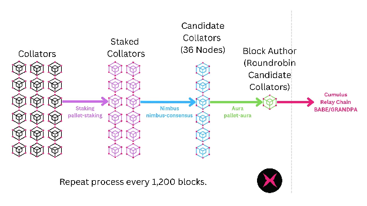
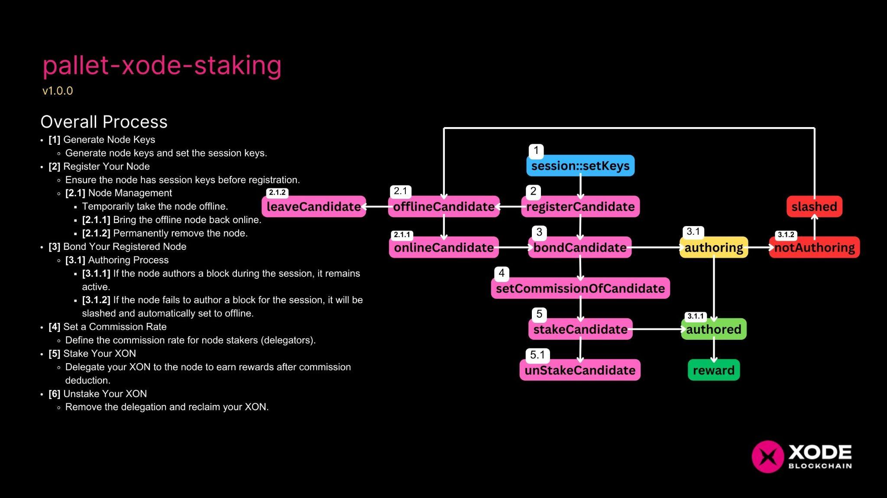
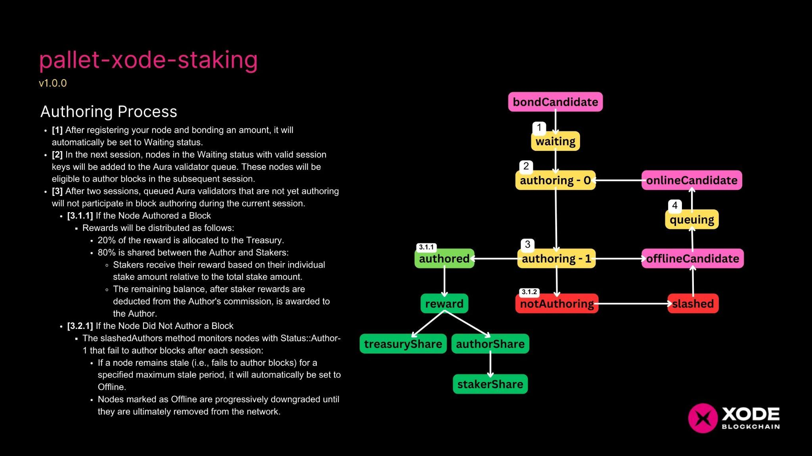
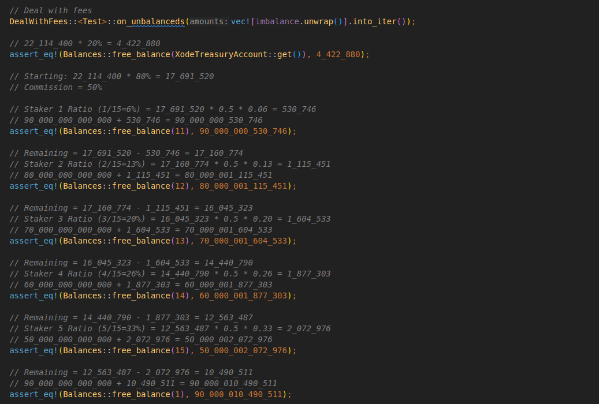
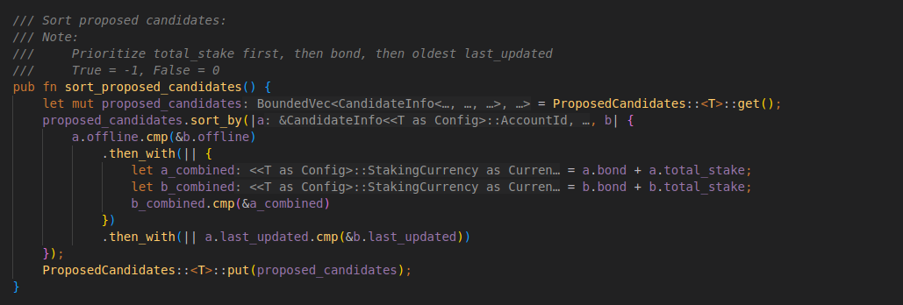

# XODE Staking

## Xode Consensus

Polkadot relies on a hybrid consensus model. In this scheme, the block finality gadget and the block production mechanism are separate. Consequently, parachains only need to focus on producing blocks while relying on the relay chain to validate state transitions.

Xode Blockchain, as a parachain, must address the following problems in a trustless and decentralized manner.

1. Which nodes are allowed to author blocks?  
2. If multiple nodes are allowed to author blocks, which one will be permitted to author at a particular time, since there should only be one author at any given moment?

Enter Xode Consensus. Xode Consensus is a framework for building slot-based consensus algorithms on Cumulus-based parachains. It strives to provide standard implementations for the logistical parts of such consensus engines and helpful traits for implementing the elements (filters) that researchers and developers want to customize. These filters can be customizable to define what a block authorship slot is and can be composed, so block authorship is restricted to a subset of collators in multiple steps.

In Xode Blockchain we will be using a two-layer filter approach.  

1. **Staking**: The first layer comprises the parachain staking filter, which helps select an active collator pool among all collator candidates using a staked-based ranking.   
2. **Allocating**: The second layer adds another filter which narrows down the number of collators to a subset for each slot.

Xode Consensus can only answer which collator(s) are eligible to produce a parachain block in the next available slot. It is the Cumulus consensus mechanism that marks this parachain block as best, and ultimately the BABE and GRANDPA hybrid consensus model (of the relay chain) that will include this parachain block in the relay chain and finalize it. Once any relay chain forks are resolved at a relay chain level, that parachain block is deterministically finalized.

## Staking

Collators can join the candidate pool by simply bonding some XON via an extrinsic. Once in the pool, XON holders can add to the candidate's stake via delegation (also referred to as staking).

Nimbus selects the top 36 candidates in terms of XON staked in the network, which includes the candidate's bond and delegations from XON holders. This filtered pool is called selected candidates, and selected candidates are renewed every round (which lasts 1,200 blocks). 

## Allocating

The Aura protocol (PoA) plays a crucial role in Xode Blockchain’s block production mechanism. Specifically, for the list of candidates generated by Nimbus, Xode Blockchain adopts the standard Aura protocol from Polkadot to allocate block authoring responsibilities. In this setup, the block author for each time slot is determined in a deterministic and round-robin manner.

This means that all 36 candidates in Xode’s collator set are arranged in a fixed sequence, and each time slot is assigned to the next collator in the list. The round-robin approach ensures that every collator gets an equal and predictable opportunity to produce blocks. After the last collator produces a block, the sequence restarts from the first collator.

By leveraging Aura, Xode Blockchain ensures fairness, efficiency, and predictability in block production while maintaining compatibility with Polkadot’s consensus design. This protocol also minimizes the risk of block production conflicts, as only the assigned collator for a given slot is authorized to create a block, ensuring the stability and continuity of the blockchain.

## Invulnerable Candidates

Invulnerable candidates in Xode Blockchain consensus refers to specific collator nodes that are designated as essential for the network's operation. These nodes are marked as "invulnerable" because they have a special role in maintaining consensus and are protected from being slashed or forcibly removed under certain conditions. Here's a breakdown:

### Critical for Network Operations:

* These collators are pre-configured in Xode Blockchain.  
* They are crucial in early network stages or when running testnets to ensure stability and reliability.

### Cannot Be Slashed:

* Unlike other candidates, invulnerable nodes are immune to penalties like slashing, even if they behave incorrectly (e.g., go offline or equivocate).  
* This protection ensures that the network does not lose critical collator nodes.

### Inclusion the Nimbus Selection of Candidates:

* Invulnerable nodes are not subject to the normal Nimbus selection of candidate processes.   
* They are automatically included in the active validator set.

## The Xaver Invulnerable Nodes

The Xaver node is a designated invulnerable node in the Xode Blockchain, playing a pivotal role in ensuring network stability and reliability. It is composed of light clients installed on specialized appliances, enabling efficient and lightweight participation in the network. As an invulnerable node, Xaver is immune to slashing and bypasses the standard collator candidate election process, guaranteeing its continual operation. This design ensures that even in scenarios of reduced collator availability or network disruptions, the Xaver node can sustain block production, preventing potential stalls. By leveraging the lightweight nature of its client setup, the Xaver node also promotes resource efficiency while serving as a backbone for maintaining trustless and decentralized operations in the Xode network.

## Staking Process

The staking process begins with generating node keys and setting the session keys, which are essential for the node to participate in the network. After ensuring the node has valid session keys, it is registered to begin its participation in block authoring and staking activities. Once registered, the node can be managed in various ways: it can be temporarily taken offline, brought back online, or permanently removed from the network if necessary.

Once a node is registered and active, it must be bonded in order to engage in the authoring process. If the node authors a block during a session, it remains active and continues to participate. However, if the node fails to author a block during its session, it will be slashed and automatically set to offline, reducing its chance to participate in future sessions. This mechanism ensures that only active and reliable nodes remain in the network.

Additionally, node operators can define a commission rate, which dictates how rewards are distributed between the node and its stakers (delegators). Stakers can delegate their XON tokens to a node, allowing them to earn rewards based on their stake. The rewards are given after deducting the node's commission. If stakers wish to change their participation, they can unstake their XON tokens, removing their delegation and reclaiming their tokens. This process helps maintain a dynamic and secure staking system, where active nodes and participants are continuously rewarded.

## Authoring Process

After registering your node and bonding an amount, it will automatically be assigned a **Waiting** status. In the next session, nodes with the **Waiting** status and valid session keys are added to the Aura validator queue. These nodes become eligible to author blocks starting in the subsequent session. However, queued validators that have not started authoring after two sessions will not participate in block authoring for the current session. This staged process ensures that only properly configured and active nodes contribute to block production.

When a node successfully authors a block, rewards are distributed among the Treasury, the Author, and the Stakers. Specifically, 20% of the reward goes to the Treasury, while the remaining 80% is shared between the Author and the Stakers. Stakers receive their rewards based on their proportional stake relative to the total stake, with the Author retaining the remaining balance after staker rewards are deducted from the Author’s commission. Conversely, if a node fails to author a block during its session, the `slashedAuthors` mechanism tracks its performance. Nodes that remain stale for a specified maximum period are automatically set to **Offline**. Offline nodes are progressively downgraded and eventually removed from the network to maintain the integrity and reliability of the staking system.

## Sample Reward Computation

The reward distribution is calculated based on a total reward of `22,114,400`. First, 20% of the reward (`4,422,880`) is allocated to the Treasury, while the remaining 80% (`17,691,520`) is distributed among the Author and Stakers. The Author's commission is set at 50%, leaving the other half (`8,845,760`) to be distributed among the Stakers based on their respective stake ratios. For example, Staker 1, with a ratio of 6% (`1/15`), receives `530,746`, which is added to their starting balance of `90,000,000,000,000`. Subsequent stakers receive their proportional share (e.g., Staker 2 with 13% receives `1,115,451`, Staker 3 with 20% receives `1,604,533`, and so on), with each calculation reducing the remaining amount for the next staker.

Finally, after all stakers are rewarded, the remaining amount of `10,490,511` is added to the Author’s balance, reflecting their commission share and any undistributed rewards. This ensures a precise and equitable distribution based on stake ratios while validating the results through assertions that compare calculated balances against expected values.

## Sorting of Candidates

The `sort_proposed_candidates` function organizes a list of candidates based on three criteria to ensure a fair and logical order. First, it prioritizes candidates based on their **offline status**, where those not marked as offline are preferred. Next, it considers the **combined value of the candidate’s bond and total stake**, prioritizing those with higher values. If candidates are still tied, it uses the **last updated timestamp**, giving preference to those with older timestamps. This sorting logic ensures that active, well-staked, and experienced candidates are ranked higher.

After sorting, the updated list is saved back to the blockchain state. The sorting uses the `then_with` method to apply these criteria in sequence, moving to the next criterion only when the previous one does not determine an order. This approach ensures a deterministic and fair ranking, optimizing the selection of candidates for tasks like staking or validation.
