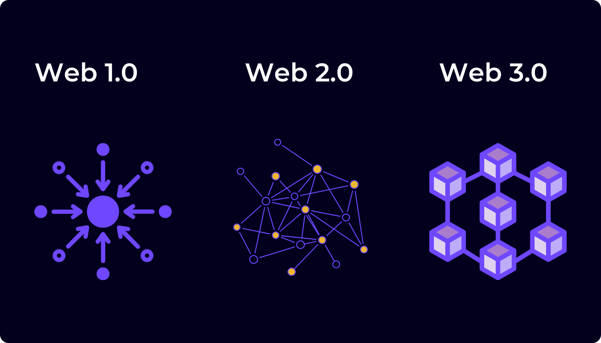

# Web3

Web3 是一个术语，指的是基于区块链技术和密码学原理构建的去中心化、以用户为中心的互联网愿景。它代表了对当前网络（Web 2.0）的范式转变，后者由社交媒体平台、搜索引擎和在线市场等中心化实体主导。

在 Web3 中，对数据和数字资产的控制权从中心化机构转移到个人手中。区块链技术是 Bitcoin、Ethereum、Polkadot 和 XODE 等加密货币的底层技术，在实现这种去中心化方面发挥着核心作用。智能合约是一种自动执行的合约，其协议条款直接写入代码中，可以在无需中介的情况下促成自动化的交易和交互。

与 Web3 相关的关键概念和技术包括去中心化金融（DeFi）、非同质化代币（NFT）、去中心化自治组织（DAO）、去中心化应用（DApp）等。Web3 的目标是创建一个更加透明、安全和包容的互联网，赋能用户并促进创新。

## 信任与真实

### 去信任化

Web3 平台依靠密码学原理和去中心化共识机制，力求最大限度地减少各方之间对信任的需求。在传统系统中，人们通常依赖银行或政府等中心化机构来促成交易和核实信息。然而在 Web3 中，通过使用区块链（交易以透明且不可篡改的方式记录）和智能合约（无需中介即可自动执行协议）等技术，对信任的需求被最小化甚至消除。这种去信任化确保参与者可以直接相互交互，而无需依赖受信任的第三方。

### 真实性

在 Web3 中，真实性指的是存储在区块链上的信息的准确性和完整性。由于区块链上的数据不可篡改、防止篡改，一旦记录就无法被更改或删除。这一特性确保了存储在区块链上的信息被视为真实可靠。此外，权益证明（PoS）或工作量证明（PoW）等共识机制确保网络中的所有参与者就交易的有效性和区块链的状态达成一致，从而进一步增强了数据的真实性。

## 演进

### Web1（1990 年代 \- 2000 年代初）

* Web1 通常被称为"只读"网络，出现于互联网的早期阶段。其特点是静态网页，主要包含文本和基本的 HTML 格式。  
* 网站主要用于提供信息，用户交互仅限于浏览内容。  
* 例子包括 Yahoo\!、GeoCities 等早期网站，以及 Altavista 和 Lycos 等早期版本的搜索引擎。  
* 其重点在于让信息易于获取，并构建万维网的基础设施。

### Web2（2000 年代中期 \- 至今）

* Web2 通常被称为"读写"网络，标志着向动态、交互式和用户生成内容的转变。  
* Facebook、Twitter 和 YouTube 等社交媒体平台日益突出，使用户能够创建和分享内容、与他人建立联系并参与在线社区。  
* Web2 引入了用户生成内容、社交网络、博客和电子商务等概念。  
* Google、Amazon 和 eBay 等公司主导了在线领域，提供从搜索和广告到在线市场和云计算等各类服务。  
* 其重点在于用户参与、协作，以及通过广告和数据收集实现变现。

### Web3（新兴 \- 至今）

* Web3 代表了一种基于区块链技术和密码学原理构建的去中心化、以用户为中心的互联网愿景。  
* 它旨在通过将权力从中心化机构转移到个人手中，解决数据隐私、安全和控制权等问题。  
* 与 Web3 相关的关键技术包括区块链、智能合约、去中心化金融（DeFi）、非同质化代币（NFT）、去中心化自治组织（DAO）和去中心化应用（DApp）。  
* Web3 倡导去信任化、透明性和包容性，无需中介即可实现点对点交易、自动化协议和安全的数据共享。  
* Ethereum、Polkadot、XODE 等平台处于构建 Web3 基础设施的前沿，使开发者能够创建独立于中心化控制运行的去中心化应用和服务。  
* Web3 仍处于发展的早期阶段，但它有望通过提供全新的所有权、治理和价值交换模式，彻底变革金融、游戏、供应链管理等众多行业。
